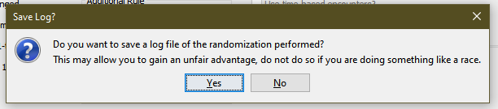

# pkmn-generate-random-team

## Usage
Requires python 3 or higher.

`python generate_random_team.py` prompts you for input using the included `genX.txt` files. Also has command line flags:

```
usage: generate_random_team [-h] [-i INFILE] [-c COUNT] [-o OUTFILE]

options:
  -h, --help            show this help message and exit
  -i INFILE, --infile INFILE
                        List of pokemon to generate a team from
  -c COUNT, --count COUNT
                        Number of times to shuffle the list (default 1167)
  -o OUTFILE, --outfile OUTFILE
                        Destination file to write generated team
```

For the purpose of being able to do this with a randomizer, I've included a utility `parse_randomizer_log.py` which should be run first.

```
usage: parse_randomizer_log [-h] [-o OUTFILE] [-f FIND] [--withloc | --no-withloc] logfile

positional arguments:
  logfile               The logfile generated by the randomizer

options:
  -h, --help            show this help message and exit
  -o OUTFILE, --outfile OUTFILE
                        File to write the possible wild Pokemon to
  -f FIND, --find FIND  Pokemon to retrieve all possible locations for
  --withloc, --no-withloc
                        Extract pokemon and attach a list of their locations

```

This randomizer is currently only compatible with logfiles generated by the [Universal Pokemon Randomizer](https://pokehacks.dabomstew.com/randomizer/).
When you randomize your ROM, make sure to save your logfile:



You can generate the list of pokemon available to be caught in your randomized ROM using the parsing utility, and pass that to the random team generator like this:

```
python3 parse_randomizer_log emerald.gba.log -o random_emerald.txt --withloc
python3 generate_random_team -i random_emerald.txt -o team.txt
```

## Purpose

Sometimes you just wanna do a run where you don't get to pick which Pokemon you use. This'll pick em for ya.

## Lists

Each list is a curated list of *technically* obtainable pokemon in each game from their _regional_ pokedex, reduced to their final available evolutionary line form; i.e, instead of Bulbasaur, Ivysaur, and Venusaur counting as separate, I reduced it down to just Venusaur. It's up to you if you don't wanna evolve it. I'm not dictating challenge run rules here, I'm just generating pokemon.

Lists were taken from the serebii or pokemondb.net regional dex lists for each game, which I then added bracketed notes for the version exclusives. Where possible, it generates teams from the same game -- so if it would give you a pokemon from Leafgreen, but it has already given you a pokemon from FireRed, it will skip all LeafGreens until a non-exclusive or other FR pokemon shows up.


### Notes

- BDSP uses the exact same pokedex as DP did.
- Emerald is by far the most specifically curated list.
- The lists are generated by me copying the regional pokedex to a .txt file, manually deleting the entries that aren't the end of an evolutionary line, and then appending version tags and getting rid of confirmed postgame pokemon (Lati@s, UBs, etc)
- The lists are technically biased towards pokemon with branched evolutions as a result of this process.
- Clamperl is an exception since both of its evolutions are trade-exclusive. It's listed on its own in most lists.

## Todo

Finish lists:
- Gen 8 (SwSh)
